# Реєстр технічної документації (Technical Documentation)

Модуль веде технічну документацію підприємства: картки документів, редакції з файлами,
зв'язки між документами, комплектність пакета, модифікації виробу та кодифікацію НАТО,
плюс журнал подій під ISO 9001.

Код: `erpnext/technical_documentation/`. Робочий стіл: **Технічна документація**.

---

## Зміст

1. [Що вміє модуль](#1-що-вміє-модуль)
2. [Словник об'єктів](#2-словник-обєктів)
3. [Старт і налаштування](#3-старт-і-налаштування)
4. [Крок 1. Створити документ](#4-крок-1-створити-документ)
5. [Крок 2. Перша редакція](#5-крок-2-перша-редакція)
6. [Крок 3. Ввести редакцію в дію](#6-крок-3-ввести-редакцію-в-дію)
7. [Крок 4. Замінити редакцію новою](#7-крок-4-замінити-редакцію-новою)
8. [Крок 5. Зв'язати документи](#8-крок-5-звязати-документи)
9. [Крок 6. Комплектність пакета](#9-крок-6-комплектність-пакета)
10. [Крок 7. Модифікації та кодифікація НАТО](#10-крок-7-модифікації-та-кодифікація-нато)
11. [Звіт про комплектність](#11-звіт-про-комплектність)
12. [Журнал аудиту](#12-журнал-аудиту)
13. [Права доступу](#13-права-доступу)
14. [Підводні камені](#14-підводні-камені)
15. [Чого модуль не робить](#15-чого-модуль-не-робить)
16. [Для розробника](#16-для-розробника)

---

## 1. Що вміє модуль

| Потреба | Як закрита |
|---|---|
| Єдине місце для документів | Картка **Технічний документ** + дерево розділів |
| Історія версій із файлами | **Редакція технічного документа** — окремий проведений запис із вкладеннями |
| «Актуальна ≠ остання» | Вказівник `Актуальна редакція` на картці, переставляється лише кнопкою |
| Неможливість підмінити історію | Проведена редакція не редагується, не скасовується, не перейменовується |
| Хто і коли що зробив | **Запис журналу технічної документації** — журнал бізнес-подій |
| Комплектність пакета ТУ | **Шаблон комплектності** + панель на картці + звіт |
| Супутники ТУ | **Модифікація виробу**, **Кодифікація НАТО** |
| Доступ по розділах | `User Permission` на розділ + успадкування супутниками |

Робочий стіл показує стан реєстру одним екраном:

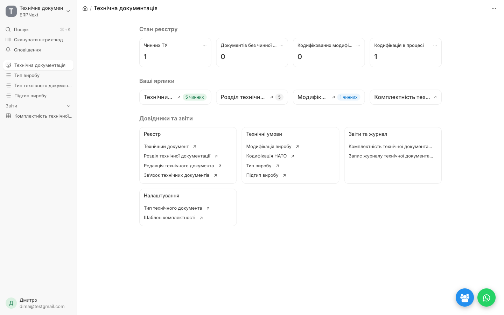

Лічильник **«Документів без чинної редакції»** — найкорисніший: документ у статусі
«Чинний» без указівника на редакцію це формальна дірка в реєстрі, і вона видна одразу.

---

## 2. Словник об'єктів

| DocType | Що це | Хто створює |
|---|---|---|
| Technical Document | Картка документа (ТУ, інструкція, договір…) | Editor |
| Technical Document Revision | Редакція з файлами, проводиться (submit) | Editor |
| Technical Document Relation | Зв'язок двох документів реєстру | Editor |
| Technical Document Section | Розділ-папка, дерево, одиниця прав | Manager |
| Technical Document Type | Тип документа + прапорці розширень | Manager |
| Document Requirement Template | Склад обов'язкового пакета | Manager |
| Product Modification | Модифікація виробу в межах ТУ | Editor |
| NATO Codification | Процедура кодифікації модифікації | Editor |
| Technical Document Audit Entry | Журнал подій, лише читання | Система |
| Product Type / Product Subtype | Довідники класифікації виробу | Manager |

---

## 3. Старт і налаштування

### 3.1 Як відкрити модуль

Не через адресний рядок і не через пошук. Модуль має свою плитку на **робочому столі** —
головний екран десктопа, куди веде логотип у лівому верхньому кутку:

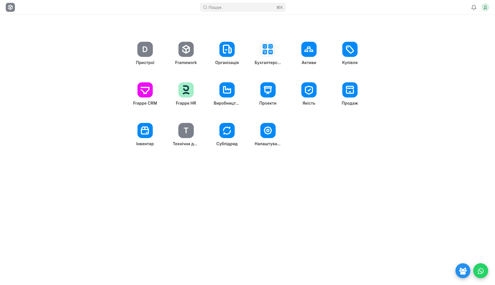

Плитка «Технічна документація» відкриває робочий стіл модуля, а зліва з'являється його
власне бічне меню з усіма списками:

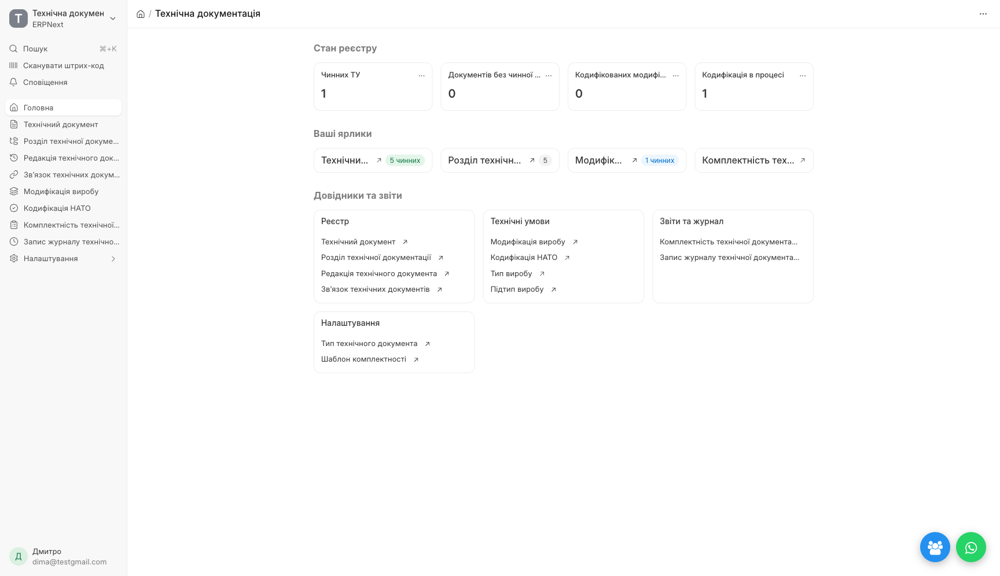

Ті самі пункти доступні через перемикач угорі ліворуч: **назва поточного простору →
Робочі простори → Технічна документація**.

> **Кому видно.** Плитка й меню показуються лише тим, у кого є хоча б один список модуля
> в правах, тобто одна з ролей `Technical Documentation Viewer / Editor / Manager`. Без
> ролі модуля людина не побачить ні плитки, ні пунктів меню — це не поламане меню, це
> права. Роль видає адміністратор у картці користувача.

### 3.2 Розділи (Technical Document Section)

Дерево папок. Розділ — це одночасно **одиниця прав** і **умова для номера**: доступ
видають на розділ, а не на кожен документ, і саме за розділом правило нумерації вирішує,
з якого префікса почнеться номер.

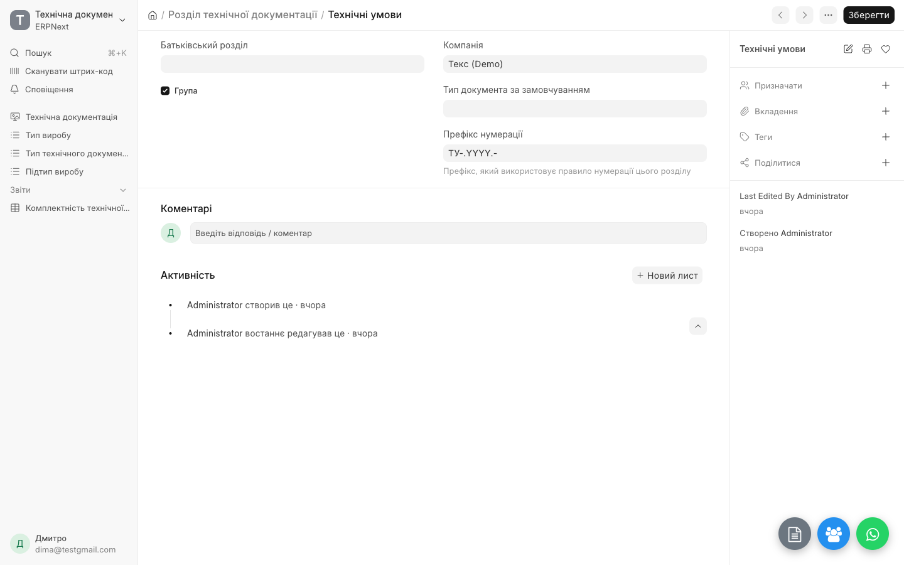

| Поле | Навіщо |
|---|---|
| `Назва розділу` | Вона ж ім'я запису — глобально унікальна, бо саме її показує `User Permission` |
| `Батьківський розділ` | Вкладеність; права на батька автоматично поширюються на дітей |
| `Це група` | Чи можна вкладати в цей розділ інші розділи |
| `Компанія` | Довідкове поле |
| `Тип документа за замовчуванням` | Підказка при створенні документа |
| `Префікс нумерації` | **Довідковий запис** префікса, а не механізм — див. нижче |

Патч сідує п'ять розділів: Технічні умови, Договори, Регламенти, Інструкції, Інше.

#### Створити розділ

**Технічна документація → Розділ технічної документації → вигляд «Дерево»**. Клік по
вузлу відкриває його кнопки:

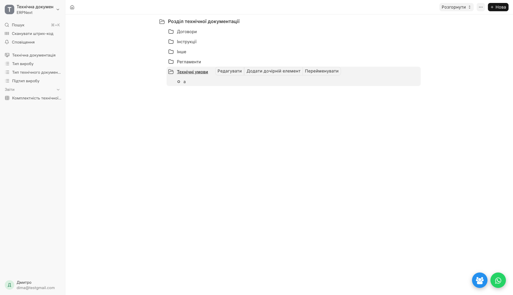

- **Додати дочірній елемент** — новий розділ усередині цього. Кнопка є лише на вузлах з
  галочкою `Це група`.
- **Редагувати** — відкрити картку.
- **Перейменувати** — змінити ім'я запису.

Розділ можна створити і зі списку (`+ Нова`), але тоді легко проґавити `Батьківський
розділ` і отримати ще один корінь дерева. У дереві структура очевидна — створюйте там.

> **Пастка:** якщо вкласти розділ у вузол **без** галочки `Це група`, запис створиться,
> але в дереві його не видно — негруповий вузол не розкривається. Дані на місці, просто
> шлях до них у дереві зник. Ставте `Це група` батькові.

#### Номер документа: чому одного префікса мало

Поле `Префікс нумерації` **саме по собі не робить нічого**. Номери роздає стандартний
механізм Frappe — `Document Naming Rule`, і патч створює по одному правилу на кожен
сідований розділ:

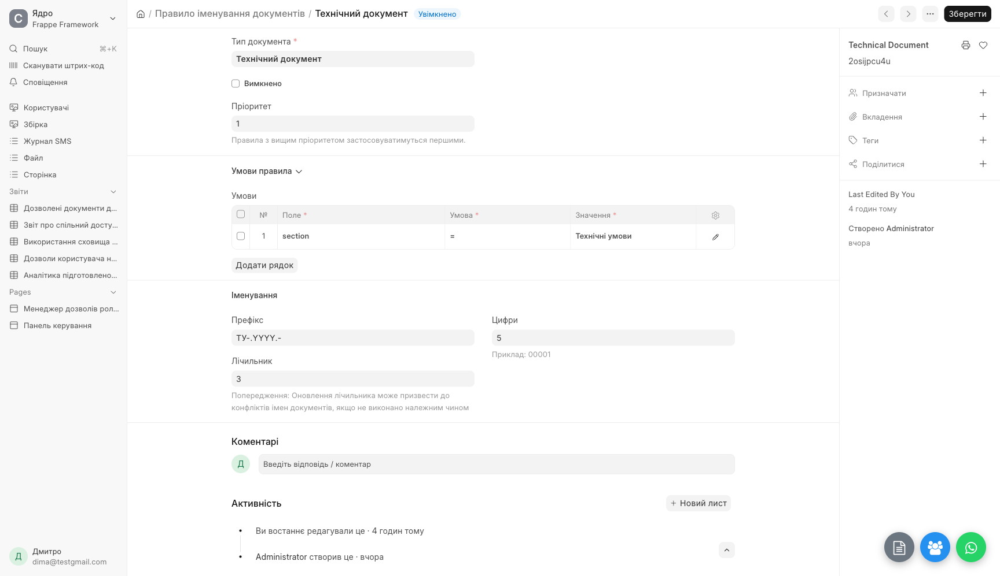

Правило читається так: `Тип документа` = Технічний документ, умова `section = Технічні
умови`, префікс `ТУ-.YYYY.-`, 5 цифр. Звідси й `ТУ-2026-00003`.

**Створили свій розділ — створіть і правило**, інакше документи в ньому отримають
резервний номер серії `TD-2026-00001`. Мінімальний набір полів: тип документа
`Technical Document`, рядок умов `section` / `=` / точна назва розділу, префікс, кількість
цифр, пріоритет. `Лічильник` не чіпайте без потреби — це поточний номер серії.

#### Перейменувати, перенести

- **Перейменування** тягне за собою документи і `User Permission` — Frappe сам
  переписує посилання. А от **умову в `Document Naming Rule` не тягне**: там назва
  розділу лежить звичайним текстом. Перейменували розділ — відкрийте його правило
  нумерації і поправте значення, інакше нові документи тихо поїдуть на резервну серію.
- **Перенесення** розділу в дереві механічно безпечне: nested set перебудовується сам,
  ім'я запису не змінюється, дозволи не ламаються. Але **обсяг** кожного виданого на
  нього дозволу змінюється разом із деревом — після реорганізації перевірте права.
- Номери вже виданих документів не змінюються ні від чого. Номер — це ідентичність.

#### Видалити розділ

Видаляти в реєстрі може **лише `Administrator`** — у всіх трьох ролей модуля право
`delete` знято навмисно. Тому в дереві звичайний користувач бачить тільки «Редагувати /
Додати дочірній елемент / Перейменувати», без «Видалити» (саме це на скріншоті вище).

Порядок для `Administrator`:

1. Розділ має бути **порожній**. Є документи — система відмовить:
   `Неможливо видалити розділ X: у ньому N документ(ів)`. Перенесіть їх в інший розділ
   через поле `Розділ` на картці.
2. Розділ не має мати **дочірніх розділів** — Frappe відмовить
   (`Cannot delete ... as it has child nodes`). Спершу видаліть дітей, знизу вгору.
3. Дерево → вузол → **Видалити**. Або список розділів → галочка → меню → **Видалити**.

Помилково створений порожній розділ ні на що не впливає: він не має документів, не
з'являється у звітах і не ламає нумерацію. Якщо доступу до `Administrator` немає —
найпростіше перейменувати його на щось нейтральне і залишити, або попросити адміністратора
видалити. Видалений розділ, до речі, лягає в `Deleted Document` і його можна відновити.

### 3.3 Типи документів (Technical Document Type)

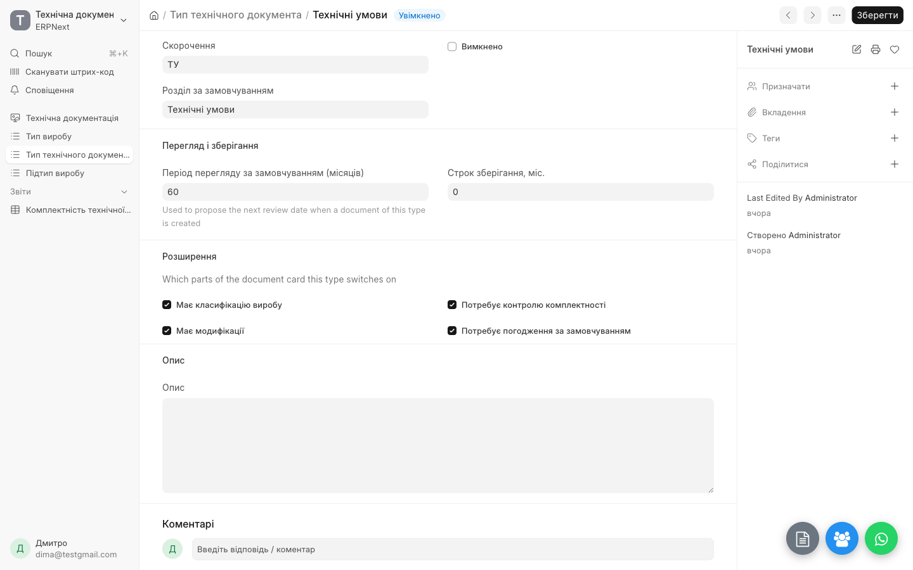

Три прапорці в секції **Розширення** керують тим, які секції з'являться на картці:

| Прапорець | Що вмикає на картці |
|---|---|
| `Має класифікацію виробу` | Секція «Класифікація виробу» (тип / підтип / модель) |
| `Має модифікації` | Секція «Модифікації та кодифікація» |
| `Потребує комплектності` | Секція «Комплектність» + рядок у звіті |

Для «Технічні умови» стоять усі три. Для «Договір» — жодного, і карточка договору
виглядає просто, без зайвих блоків.

Ще два поля: `Період перегляду (місяців)` і `Період зберігання (місяців)` — довідкові
значення для дат ISO.

### 3.4 Шаблон комплектності (Document Requirement Template)

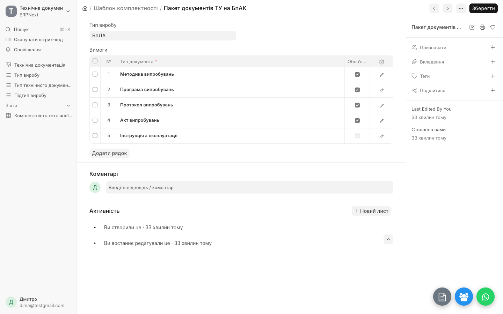

Список типів документів, які мають бути в пакеті. Галочка `Обов'язковий` вирішує, чи
рядок потрапляє в знаменник відсотка. Необов'язкові рядки показуються, але відсоток не
псують.

---

## 4. Крок 1. Створити документ

**Технічний документ → + Новий.**

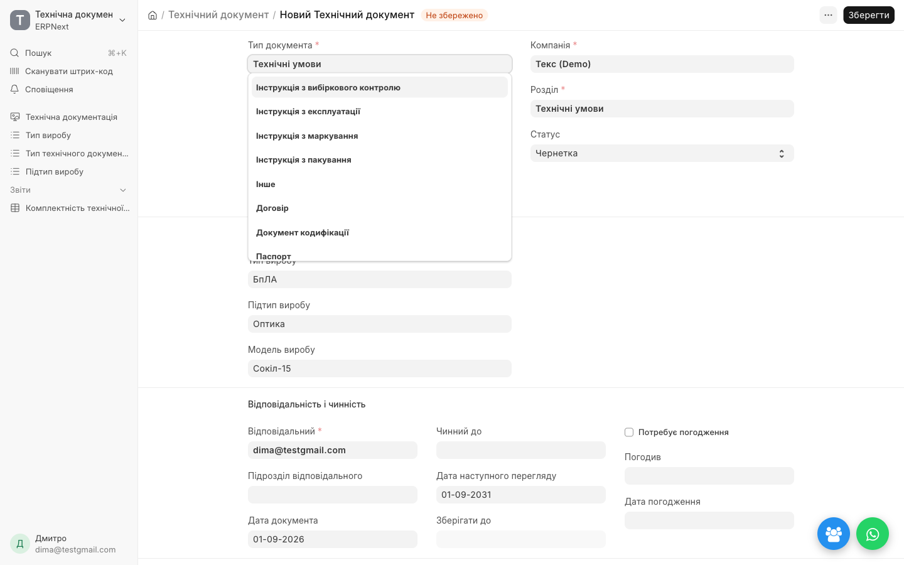

1. **Тип документа** — обирається першим. Одразу після вибору з'являються секції
   розширень цього типу (на скріншоті вже видно «Класифікація виробу»).
2. **Розділ** — визначає і права, і номер.
3. **Відповідальний** — обов'язковий, це власник документа в реєстрі.
4. **Позначення документа** — ваш шифр (`ТУ У 30.3-40265219-015:2026`), не плутати з
   номером у системі.

Після збереження документ отримує номер за префіксом розділу:

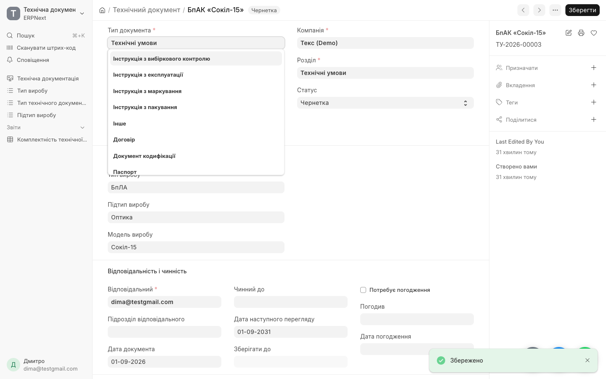

> Документ створюється у статусі **Чернетка**. Статус міняється вручну — маршрутів
> погодження в цій ітерації немає.

---

## 5. Крок 2. Перша редакція

Редакція — окремий запис, а не рядок таблиці: у неї власні файли, власний автор і власна
незмінність.

Найкоротший шлях — кнопка **«Нова редакція»** на картці документа, поруч із «Зберегти»:
вона відкриває порожню редакцію, вже прив'язану до цього документа й з сьогоднішньою датою
створення. Довгий шлях той самий: **Редакція технічного документа → + Нова**, але тоді
документ доводиться обирати руками.

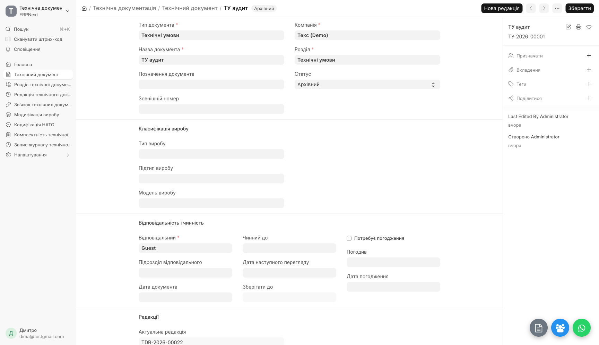

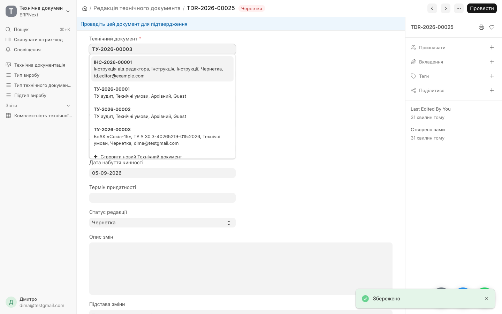

Заповнюється:

| Поле | Навіщо |
|---|---|
| `Технічний документ` | до якої картки належить |
| `Номер редакції` | «1», «2.0», «ред. 3» — довільний текст |
| `Підстава зміни` | **головне поле для ISO**: чому виникла ця редакція |
| `Дата набуття чинності` | з якої дати редакція діє; можна лишити порожньою — кнопка «Ввести в дію» проставить сьогоднішню |
| `Word-файл` / `Файл PDF` / `Скан із підписом` / `Додаткове вкладення` | сам документ у трьох формах плюс супровідне |

Далі — **Провести (Submit)**. Система перепитає:

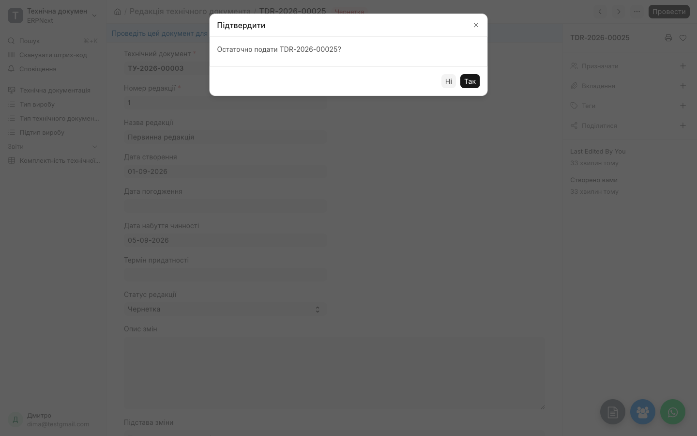

Після проведення редакція стає незмінною: відкритими лишаються тільки ті поля, що
законно змінюються **пізніше** — статус, дата набуття чинності, дата припинення й коментар.

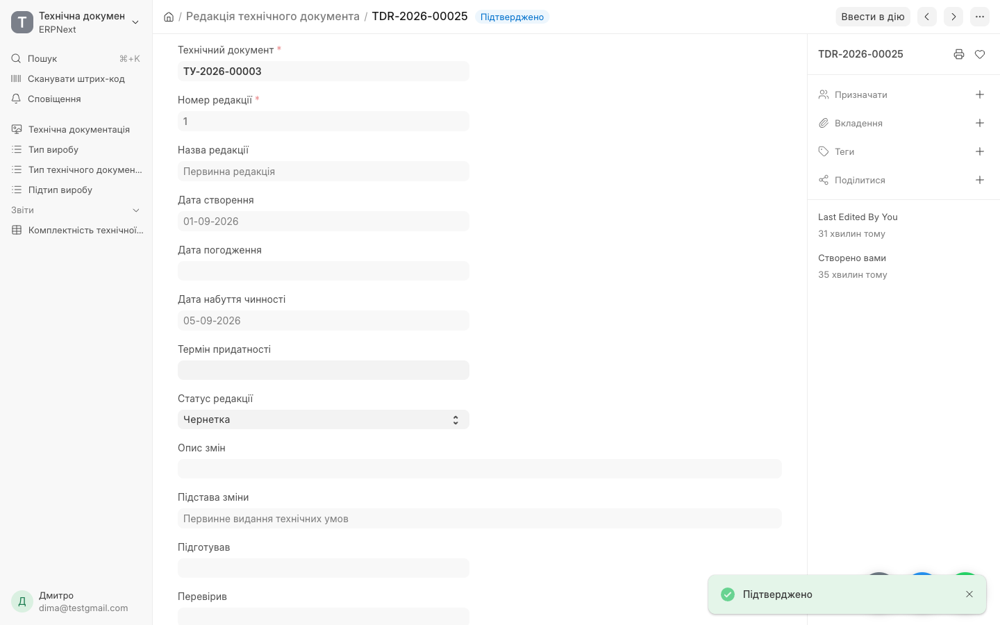

---

## 6. Крок 3. Ввести редакцію в дію

На проведеній редакції з'являється кнопка **«Ввести в дію»**. Це єдиний спосіб зробити
редакцію чинною — поле `Актуальна редакція` на картці документа лише для читання.

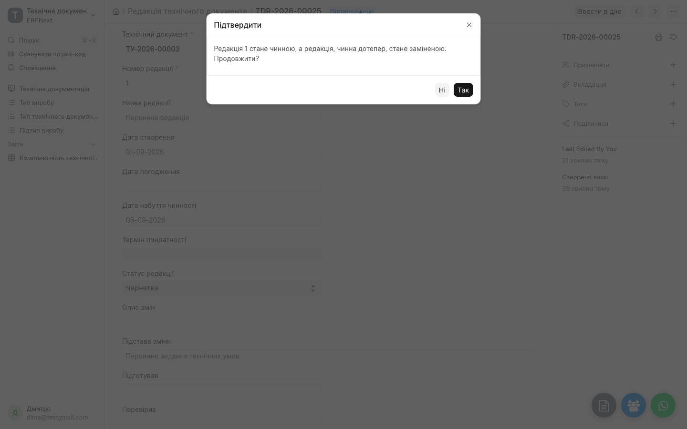

Одним натисканням відбувається три речі:

1. редакція, чинна дотепер, стає **Заміненою** й отримує дату припинення;
2. ця редакція стає **Чинною**;
3. указівник `Актуальна редакція` на картці документа переходить на неї.

Кожен крок пишеться в журнал. Робити це руками в три збереження не треба — та й не
вийде: правило «одна чинна редакція» відхилить середній крок, якщо забути перший.

На картці документа з'являється таблиця редакцій із позначкою **Актуальна**:

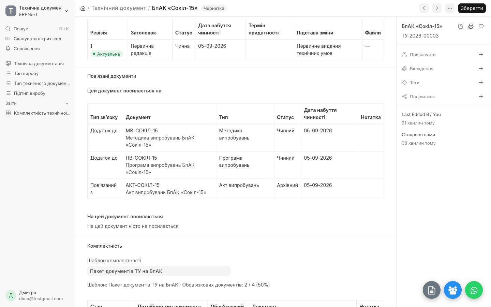

---

## 7. Крок 4. Замінити редакцію новою

Створюєте редакцію «2», проводите, тиснете **«Ввести в дію»**. Результат:

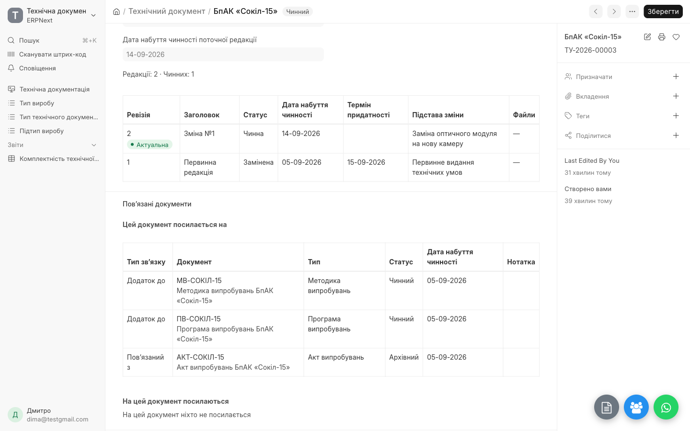

Редакція 1 — **Замінена**, з датою припинення. Редакція 2 — **Чинна**. Обидві лишаються
в реєстрі назавжди: історичний запис не видаляється й не ховається.

> Скасувати (Cancel) проведену редакцію не може ніхто, включно з Адміністратором — права
> `cancel` не видані жодній ролі. Помилкова редакція заміщується наступною, а не зникає.

---

## 8. Крок 5. Зв'язати документи

**Зв'язок технічних документів → + Новий**: головний документ, пов'язаний документ і тип
зв'язку (Замінює / Додаток до / Повʼязаний з / Розроблений на підставі / …).

На картці зв'язки показуються **у два боки** (див. скріншот у розділі 6):

- **«Цей документ посилається на»** — зв'язки, створені від цього документа;
- **«На цей документ посилаються»** — зв'язки, створені з інших карток.

Це важливо для методики випробувань, яка існує в одному екземплярі й на яку посилається
кілька ТУ: з картки методики видно всі ТУ, що її використовують.

Обмеження: документ не можна зв'язати сам із собою, і та сама пара «документ + документ +
тип» двічі не створюється.

---

## 9. Крок 6. Комплектність пакета

Виберіть на картці `Шаблон комплектності` — і панель порахує пакет:

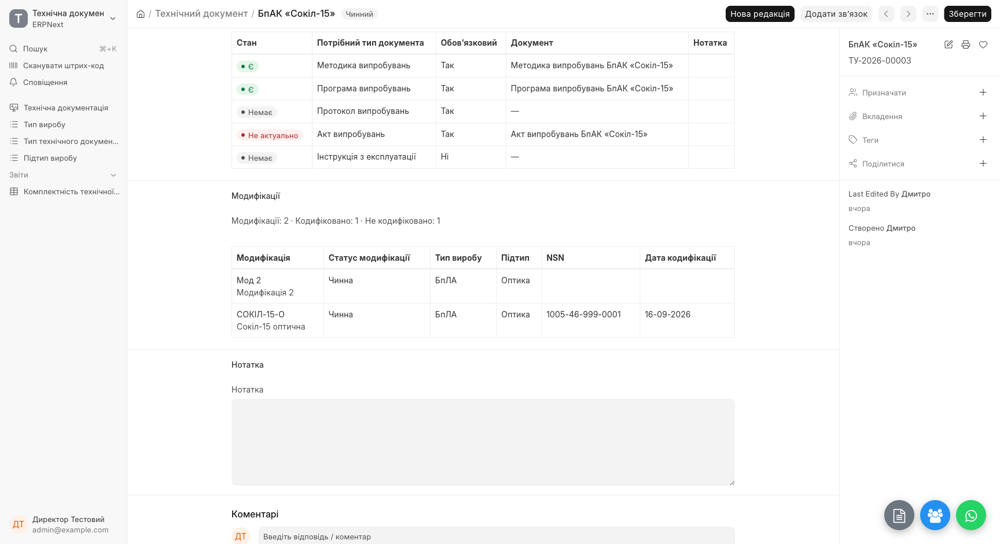

Чотири стани замість двох:

| Стан | Коли |
|---|---|
| **Є** | знайдено документ потрібного типу, статус «Чинний», є чинна редакція |
| **Прострочено** | усе гаразд, але минула дата `Чинний до` або `Дата наступного перегляду` |
| **Не актуально** | документ знайдено, але він Замінений / Скасований / Архівний, або в нього немає чинної редакції |
| **Немає** | документа такого типу серед зв'язків немає |

> **Головне правило:** комплектність рахується **лише по зв'язках**. Документ, який
> фізично існує, але не прив'язаний до ТУ, у пакет не потрапить. Це свідомо: інакше
> система вгадувала б належність за назвою й тихо помилялася.

Відсоток рахується тільки по обов'язкових рядках. У прикладі 2 із 4 — 50 %.

---

## 10. Крок 7. Модифікації та кодифікація НАТО

**Модифікація виробу** — виконання в межах одного ТУ (оптична, радіо, перехоплювач).
Прив'язується до ТУ; система не дасть прив'язати її до інструкції чи договору — лише до
типу з прапорцем `Має модифікації`.

**Кодифікація НАТО** — окрема процедура на пару «ТУ + модифікація»:

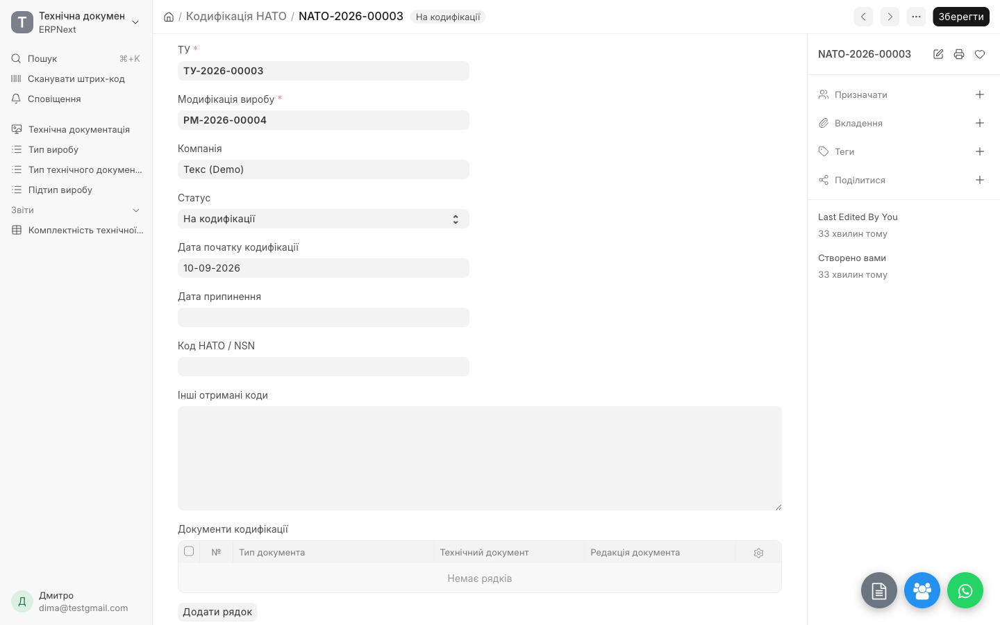

- `Статус` веде процедуру: Не розпочато → Підготовка документів → На випробуваннях → На
  кодифікації → Кодифіковано (або Відхилено / Скасовано).
- `Код НАТО / NSN` заповнюється, коли код отримано.
- `Документи кодифікації` — **посилання** на документи й конкретні редакції, а не копії.

Система перевіряє, що модифікація належить саме тому ТУ, яке вказане в кодифікації —
інакше панель на картці ТУ показувала б чужу кодифікацію як свою.

Зведення на картці ТУ: `Модифікації: 1 · Кодифіковано: 0 · В процесі: 1 · Не
кодифіковано: 0` (див. скріншот у розділі 9).

---

## 11. Звіт про комплектність

**Звіти → Комплектність технічної документації.**

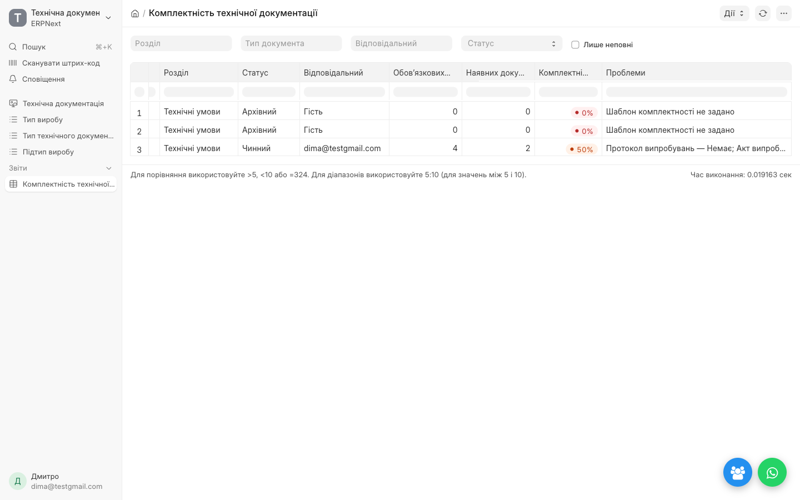

- Рахує наживо, тим самим кодом, що й панель на картці — цифра у звіті й цифра на картці
  не можуть розійтися.
- Показує **лише типи з прапорцем** `Потребує комплектності`: у договору немає пакета,
  і в звіті його немає.
- Документ без шаблону не ховається, а показується з проблемою «Шаблон комплектності не
  задано» — невиміряний документ це теж дірка.
- Колонка **Проблеми** перелічує, чого саме бракує.
- Фільтр **«Лише неповні»** лишає тільки рядки з відсотком < 100.
- Звіт бачить те саме, що й користувач: двоє людей запустять і побачать різні набори
  рядків, але **однакові відсотки** по спільних документах.

---

## 12. Журнал аудиту

**Звіти та журнал → Запис журналу технічної документації.**

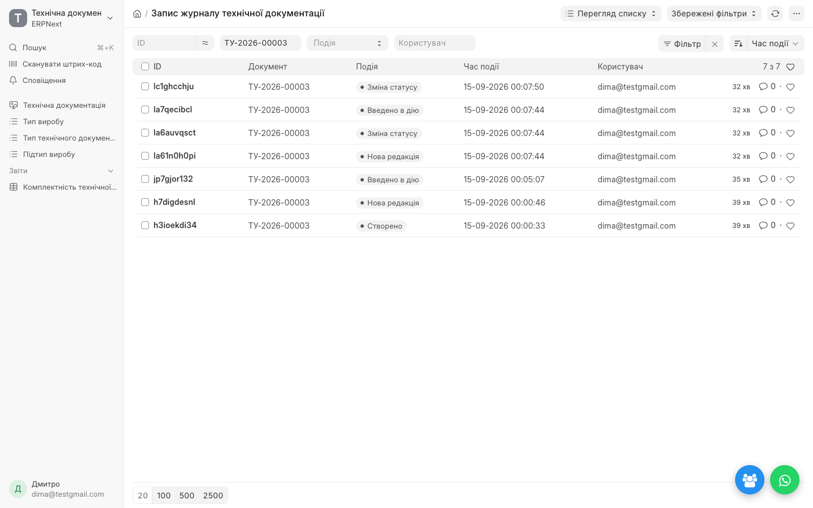

Журнал фіксує бізнес-події, яких не видно з дифів полів:

Створено · Нова редакція · Введено в дію · Зміна статусу · Зміна відповідального ·
Архівовано · Скасовано · Погоджено · Відхилено.

На скріншоті — весь сценарій із цього гайду, від створення картки до другого введення в
дію.

> Записи журналу **не створюються й не редагуються руками** — навіть Адміністратором:
> контролер відхиляє і вставку ззовні модуля, і будь-яку зміну вже записаного. Стандартний
> `Version` (Track Changes) продовжує писати дифи полів окремо.

---

## 13. Права доступу

### Три рівні

| Рівень | Механізм |
|---|---|
| Увесь реєстр | Роль: Viewer (читає) / Editor (створює й редагує) / Manager (+ довідники, дерево) |
| Розділ | `User Permission` на **Technical Document Section** |
| Окремий документ | Стандартна кнопка **Поділитися** (DocShare) |

### Як видати доступ на розділ

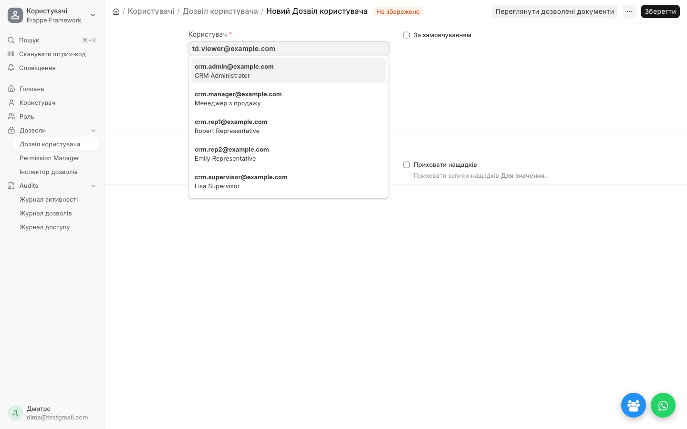

**Дозвіл користувача (User Permission)**: `Дозволити` = Technical Document Section,
`Для значення` = потрібний розділ. Дозвіл на батьківський розділ автоматично поширюється
на всі підрозділи (nested set). Галочка `Hide Descendants` це вимикає.

### Що успадковується автоматично

Редакції, зв'язки, модифікації, кодифікації та записи журналу **не мають власного поля
«розділ»** — вони успадковують права свого документа: хто бачить картку, той бачить її
редакції; хто не бачить картку, для того їх немає в жодному списку. Файли успадковують
права редакції стандартним механізмом Frappe.

### Видалення

Видаляти будь-що в реєстрі може **лише Administrator** — у всіх ролей право `delete`
знято. Для користувачів передбачені статуси «Скасований» і «Архівний».

Практичний наслідок: у дереві розділів звичайний користувач не побачить кнопки
«Видалити» взагалі — Frappe малює її тільки тим, у кого є право. Помилково створений
розділ прибирає адміністратор, порядок — у розділі 3.2.

---

## 14. Підводні камені

Те, через що можна впертися.

**Редакції**

- `Актуальна редакція` — read-only. Єдиний шлях — кнопка **«Ввести в дію»** на проведеній
  редакції.
- Дві чинні редакції одного документа неможливі. Правило діє й **після** проведення: ви
  не зробите другу редакцію чинною вручну через поле статусу.
- Вказати актуальною редакцію іншого документа, непроведену або замінену — система
  відхилить.
- Проведену редакцію не можна ані скасувати, ані перейменувати.

**Комплектність**

- Рахується **лише по зв'язках**. Немає зв'язку — немає документа в пакеті.
- Відсоток однаковий для всіх, незалежно від прав. Але назва документа, до якого немає
  доступу, ховається — рядок лишається, ім'я зникає.
- Порожній `Шаблон комплектності` — не «100 %», а «шаблон не задано».

**Типи й секції**

- Секції розширень залежать від прапорців типу. Зняли прапорець — секція зникла з усіх
  карток цього типу; **дані не видаляються**, вони просто не показуються.
- Змінити тип документа після створення можна, але номер уже виданий і не перевидається.

**Нумерація**

- Номер дає не поле `Префікс нумерації` на розділі, а окреме `Document Naming Rule` з
  умовою `section = <назва розділу>`. Поле на розділі — довідкове.
- Свій розділ без власного правила → документи в ньому отримають резервну серію
  `TD-.YYYY.-`.
- Перенесли документ в інший розділ — номер **не змінюється**. Так і має бути: номер це
  ідентичність.

**Розділи**

- Ім'я розділу унікальне глобально — наслідок того, що `User Permission` показує саме ім'я.
- Перенесення розділу в дереві тихо змінює **обсяг** усіх виданих на нього дозволів.
  Механічно нічого не ламається, але перевіряйте права після реорганізації дерева.
- Перейменування розділу не оновлює умову в `Document Naming Rule` — правило треба
  поправити руками, інакше нумерація тихо переходить на резервну серію.
- Розділ, вкладений у негруповий розділ, зникає з дерева, хоча запис існує.
- Видалити розділ може лише `Administrator`, і лише порожній та без дочірніх розділів.

**Статуси**

- Значення статусів зберігаються українською. Будь-яке порівняння в коді мовозалежне;
  усі значення зібрані в `erpnext/technical_documentation/constants.py`, перейменування =
  патч на дані + правка одного файлу.
- «На погодженні» і «Погоджено» проставляються вручну — механіки погодження ще немає.

**Супутники**

- Модифікацію можна прив'язати лише до документа типу з `Має модифікації`.
- Кодифікацію — лише до модифікації **того самого** ТУ.

**Продуктивність**

- Звіт рахує комплектність окремо для кожного документа (по запиту на документ). На
  кількох сотнях ТУ це помітно. Свідомий обмін: збережений відсоток розходився б із
  карткою, а це найгірше, що може статися з реєстром під ISO.

**Розгортання**

- Записи, що приїхали з дева зі своїми іменами, лишають лічильники серій позаду.
  Патч `repair_technical_documentation_data` посуває лічильники вперед — без нього
  **перший же створений зв'язок падає** з помилкою «вже існує».

---

## 15. Чого модуль не робить

| Не робить | Що замість |
|---|---|
| Маршрути погодження | Статуси проставляються вручну; Workflow — друга хвиля |
| Нагадування про перегляд | Дати є (`Дата наступного перегляду`, `Чинний до`), сповіщення налаштовуються стандартним `Notification` |
| Автоматичну зміну статусу за простроченням | Свідомо: систему, що вночі архівує чинний документ, ніхто не контролює |
| Зв'язки з CRM/виробництвом | `ALLOWED_LINK_DOCTYPES` поки містить лише сам реєстр |
| Об'єднання з ЄСКД | `ESKD Document` живе окремо, рішення відкладене |

---

## 16. Для розробника

### Розкладка

```
erpnext/technical_documentation/
  constants.py          усі статуси, події, назви доктайпів — одне місце
  audit.py              єдині двері в журнал (log_event / log_document_changes)
  completeness.py       get_completeness(document) — джерело правди для панелі й звіту
  panels.py             get_panels(document) — усе, що малюється на картці
  permissions.py        делегування прав супутників на документ
  doctype/…             16 доктайпів
  report/technical_documentation_completeness/
  number_card/…         4 лічильники
  workspace/…
erpnext/patches/v16_0/
  codify_technical_documentation.py      переводить прототипні доктайпи з custom=1 у код
  setup_technical_documentation.py       сіди: розділи, типи, довідники, правила нумерації
  repair_technical_documentation_data.py ремонт історичних даних + вирівнювання серій
```

### Хуки (`erpnext/hooks.py`)

- `treeviews` — дерево розділів;
- `share_access_inheritance` — шери йдуть по ланцюжку розділ → документ → супутники;
- `permission_query_conditions` + `has_permission` — делегування прав п'яти доктайпів.

### Серверні методи

| Метод | Що робить |
|---|---|
| `…completeness.get_completeness(document)` | стан пакета, перераховується щоразу |
| `…panels.get_panels(document)` | редакції, зв'язки, комплектність, модифікації одним викликом |
| `…technical_document_revision.make_effective(revision)` | вводить редакцію в дію (три записи в одній операції) |

### Правила, які легко зламати

- Панелі читаються через `frappe.get_list`, ніколи `get_all` — інакше права перестають
  діяти саме там, де їх найбільше видно.
- Журнал пишеться лише через `audit.log_event` — контролер перевіряє службовий прапорець
  і відхиляє все інше.
- Делегування прав перекладає `submit` → `write` і `amend` → `create` на документі:
  сам документ не проводиться, і питати в нього право `submit` немає сенсу.
- Прапорці типу віддаються на клієнт через `onload` (існуючий документ) і окремим
  запитом при виборі типу (новий) — на картці вони не зберігаються, щоб не розходитися
  з довідником.
